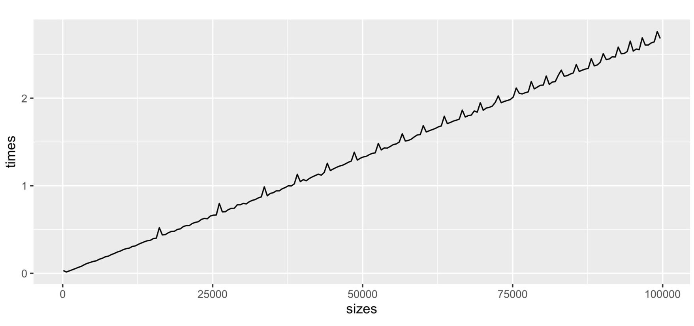

### Abstract    
This week, my focus shifted from implementation to runtime analysis and algorithm optimization for all bivariate depth functions I have implemented so far. I began by building a standard framework to test how my algorithms scale as $n \to \infty$, but quickly encountered several execution bottlenecks. To understand what was slowing my code down under the hood, I turned to *The R Inferno* by Patrick Burns [@burns2011r] and systematically improved the runtime by pre-allocating memory, eliminating matrix binding, and replacing 'for' loops with vectorized operations. Ultimately, this refactoring dropped the processing time for a dataset of 1,000,000 points to under 0.4 seconds which was a massive win for me. This process also allowed me to secure my code from edge cases that arose only when testing on large datasets. 

### Introduction 
With the core logic verified during the last few weeks, my objective transitioned from achieving the correct output to achieving the correct output efficiently. Having implemented a number of bivariate data depth algorithms like Integrated Rank-Weighted (IRW), Tukey, Mahalanobis, and Simplicial depth, my goal for this week was to eliminate R bottlenecks and syntax inefficiencies to achieve peak raw performance.

To do this systematically, I built a standard looping framework: for dataset sizes ranging from $n = 100$ up to $n = 100,000$, generate random bivariate distributions, execute the depth calculations, and record the CPU execution time.

At this stage, I had not yet learned about statistical smoothing techniques like loess regression, so I was hyper-fixated on the exact shape of the raw empirical line that I was seeing. As can be seen in the graph attached below, while the general trajectory was somewhat linear, it was full of sharp peaks that appeared to be structured and not entirely random. Moreover, the script itself ran excruciatingly slow. What began as a simple plotting exercise quickly evolved into a deep dive into understanding what goes on behind the scenes and a complete rewiring of how I approach programming.

---

### Part 1: Background Interference and Garbage Collection
* **Background Interference:** My first hypothesis for the sharp peaks was background operating system interference. I was originally using R's standard Sys.time() function to record the execution time for my algorithms. However, after discussing the issue with Dr. Leblanc, I learned that Sys.time() measures wall clock time, which means that it also captures any kind of background activity occurring alongside the algorithm. This could noticeably inflate the execution time and output incorrect numbers.

    To eliminate background noise, I switched to system.time() in my standard framework. As explained in Alexej Gossmann’s runtime guide [@alexej2017], system.time() outputs three distinct values: user, system, and elapsed. By summing purely the user and system values, you extract the exact CPU time spent executing the algorithm while stripping away external background interference. While this was a much better practice for accuracy, it did not solve the problem: the peaks remained, and the execution was still very slow.

* **Lazy Garbage Collector:** Next, I turned my attention to R's memory management. I learned that the garbage collector in R is lazy [@wickham2019advanced, chap. 2, sec. 2.6], meaning it does not clean up discarded objects continuously as code runs. Instead, it waits until memory fills up before triggering a massive cleanup to reclaim memory.

    I hypothesized that those peaks were perhaps the exact timestamps where R's garbage collector activated to clean up discarded objects from previous iterations. To test this, I added a specific command to manually trigger garbage collection after each dataset execution. My thinking was that starting every run with a clean memory slate would prevent massive, delayed cleanup cycles.

    Once again, this did not fix the issue. It was clear that the computational bottleneck was coming from the design choices that I had made in my algorithms, and that's where I needed to look next.

---

### Part 2: Rewiring a Computer Science Brain in R
Coming from a Computer Science background where languages like Java and C++ naturally utilize loop iterations, my initial R scripts were essentially all built on coding habits that are known to slow down execution in R.

To understand what was happening under the hood, I once again turned to *The R Inferno* by Patrick Burns [@burns2011r], alongside Advanced R by Hadley Wickham [@wickham2019advanced]. Using my recently written Simplicial depth algorithm as a testing "guinea pig," I identified and eliminated three major memory traps.

* **Growing Objects & Dynamic Allocation:** In many of my original implementations, I initialized storage vectors without setting a definitive length, using syntax like `results = numeric()`.

    In Chapter 2 of *The R Inferno* ("Growing Objects"), Burns explains why this destroys performance as the dataset becomes larger. Since vectors are stored in contiguous blocks of physical memory, appending a new value to a dynamically growing vector forces the system to allocate a new larger block of memory, copy every existing element over to the new address, and then append the new value. Triggering this process inside a loop of 100,000 items results in severe computational bottleneck. 
    
    The Fix: I updated all data structures to pre-allocate fixed memory from the start (e.g., `numeric(length(sizes))`), securing the required memory upfront and eliminating copying overhead entirely.

* **Failing to Vectorize:** My original implementations were full of iterative loops even for simple things like counting how many values in a vector were greater than 0. In R, an iterative loop requires evaluation at every single step, creating massive computational overhead (as detailed in Chapter 3 of *The R Inferno*: "Failing to Vectorize").

    Eliminating loops required me to completely rewire how I approached algorithm design. I had to realize that the sequential iteration I was trying to build with loops was already provided by R's vectorized operations. Through extensive reading of built-in R documentation and Stack Overflow discussions, I swapped out my manual loops with vectorized operations. While cumbersome, this process helped me learn a lot about some specific features in R such as:
    - Angle Wrapping without Loops: I learned the modulo operator trick (`atan2(y, x) %% (2*pi)`) to instantly wrap geometric angles into the $[0, 2\pi]$ range across entire vectors at once.
    - Binary Searches via findInterval(): Where I previously wrote custom nested loops to search sorted angle arrays to find exact intervals, I utilized R's findInterval() function, which performs a very fast binary search for the same outcome.
    - cumsum(): For algorithms where a running depth counter depended on its previous state, I replaced tally loops with vectorized cumulative sums (cumsum()).

* **Using rbind / cbind:** Finally, I removed every instance of matrix binding (rbind and cbind) as I learnt that binding rows to a matrix incurs the exact same penalty as growing an array [@wickham2019advanced, chap. 24, sec. 24.6].

---

### Part 3: The Payoff
After completing these optimizations on the $O(n \log n)$ Simplicial depth algorithm, I went back and applied them to every single depth algorithm I had written to date.

The Massive Win: For the $O(n \log n)$ Simplicial depth algorithm, the maximum time required for my computer to process a dataset of 1,000,000 points dropped down to under 0.4 seconds.

An unexpected bonus of this optimization journey was code robustness. Originally, I had only tested my algorithms on relatively small datasets. However, this week I was able to identify and fix several edge cases that only became apparent when the algorithms were tested on large datasets.

---

### Question: What Caused the 'Peaks'?
So, what was causing the structured, non-random peaks we observed during our initial testing? Honestly, the definitive answer remains open and none of our original hypotheses seem to explain this behavior. While we successfully optimized the algorithmic implementations as much as possible and eliminated the main bottlenecks, the underlying cause behind the non-random structure of those peaks is still ambiguous. I am learning that recognizing and documenting unsolved observations is also a part of the research process. If you happen to have any insights, or experience with similar algorithmic behavior, please connect with me on LinkedIn. I would love to hear your thoughts!

### Next Week - Asymptotic Verification
With clean, optimized R functions established, I finally have the speed required to run massive datasets for asymptotic verification. In next week's post, I will take these vectorized algorithms and evaluate how their empirical runtime trajectories compare with the theoretical Big-O expectations as $n \to \infty$.
